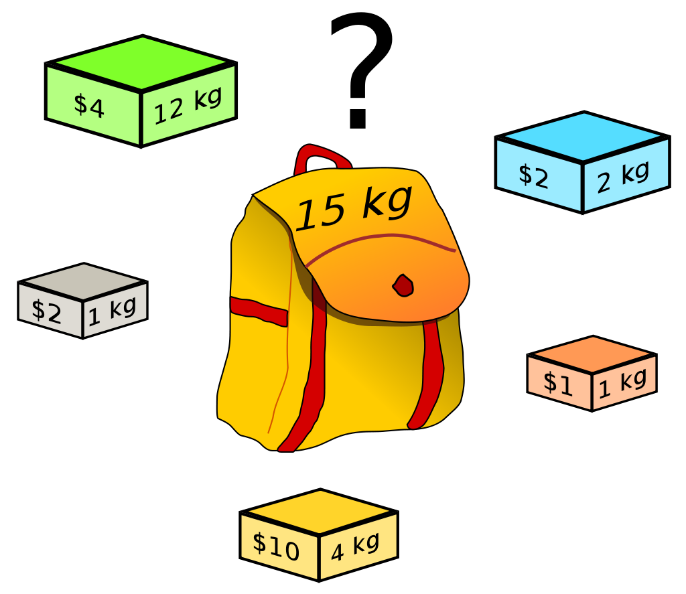
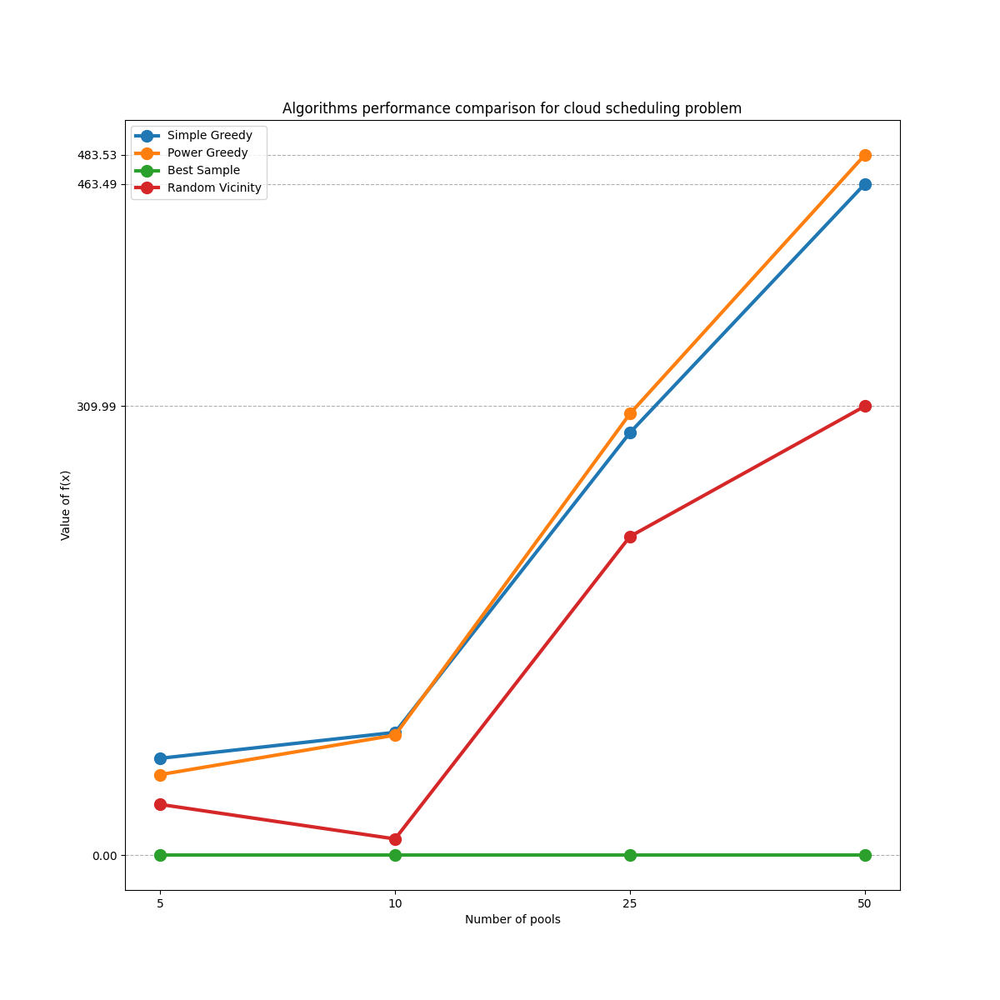

# Исследование обобщенных жадных алгоритмов в задачах нелинейной комбинаторной оптимизации

Автор: Погодин Михаил Александрович, группа 195
Научный руководитель: Посыпкин Михаил Анатольевич

---

# Актуальность задачи

* Экономия ресурсов (прикладная актуальность)
* Категоризация и обобщение (академическая актуальность)

---

# Цель и задачи дипломной работы

* Обзор существующих подходов к задаче
* Получение математической модели задачи
* Описание предложенных методов
* Реализация и тестирование предложенных методов

---

# Формальная постановка задачи

- $x$ — точка в пространстве решений
- $X$ — пространство (множество) всех возможных точек $x$
- $V(x)$ — окрестность точки $x$
- $f(x)$ — целевая функция задачи оптимизации
- $g(x)$ — функция ограничения задачи оптимизации

Формально задачу можно описать следующим образом:

$$
    f(x) \to \max\limits_{x \in X: g(x) \leq 0}
$$

---

# Задача о ранце

$$f(x) = \sum_{i = 1}^n p_i x_i \rightarrow max$$

$$g(x) = \sum_{i = 1}^n w_i x_i - C \leq 0$$

$$x_i \in \{0, 1\}, i = 1, \dots, n$$



---

# Задача расположения виртуальных машин на серверах

При расположении виртуальных машин на серверах рассмотрим следующие параметры: виртуальный размер, физический размер и пропускная способность, обозначаемые соответственно $vs$, $ps$ и $bw$. Эти параметры для сервера будут с префиксом $p$ (от $pool$), а для виртуальных машин $v$ (от $volume$). Точкой $x_{i,j}$ будет некоторая бинарная матрица, показывающая расположение виртуальной машины на определенном сервере. 

---

# Задача расположения виртуальных машин на серверах

Утилизацию параметра определенного сервера можно получить по формуле

$$PAR\_U_j(x) = \frac{\sum_{i = 1}^{N_V} vpar_i x_{ij}}{ppar_j}$$

Тогда получаем утилизацию $VSU_j$, $PSU_j$ и $BWU_j$

В таком случае оптимальность распределения ресурсов можно высчитать, как 

$$g_j(x) = 1 - max(VSU_j, PSU_j, BWU_j)$$

В качестве полной функции ограничения можно взять сумму $g(x) = \sum g_j(x)$

А для целевой функции возьмем взвешенную сумму $f(x) = \sum price_j g_j(x)$

---

# Простые методы решения задачи о ранце

### Simple greedy

На каждом шагу выбирает действие, максимизирующее целевую функцию $f(x)$

### Heuristic greedy

На каждом шагу выбирает действие, максимизирующее прирост целевой функции относительно увеличения функции ограничения, то есть максимизирует $\frac{\Delta f(x)}{\Delta g(x)}$

---

# Предлагаемый метод решения задачи о ранце

### Power-greedy

На каждом шагу выбирает действие, классифицируя окрестность точки в несколько категорий

$$
x^{i + 1} \in
\begin{cases}
L(x^i) = \{ x \in S(x^i) | g(x) < g(x^i), f(x) \geq f(x^i) \} \\
E(x^i) = \{ x \in S(x^i) | g(x) = g(x^i), f(x) > f(x^i) \} \\
G(x^i) = \{ x \in S(x^i) | g(x) > g(x^i), f(x) > f(x^i) \} 
\end{cases}
$$

После получения каждого из множеств $L$, $E$, $G$ выбирает первое непустое и из него выбирает максимальный, по относительному приросту аналогично алгоритму Heuristic greedy.

---

# Пример работы предложенного метода

$$f(x) = x_0 + x_1$$
$$X = \text{ прямоугольник } [(0, 0), (20, 20)]$$
$$(x_0 - 20)^2 + (x_1 - 25)^2 \geq 26^2 \implies$$
$$g(x) = -x_0^2 - x_1^2 + 40x_0 + 50x_1 - 349 \leq 0$$


---

# Обзор существующих методов

* Min-min
* Max-min
* Min-Max
* И другие

---

# Экспериментальная оценка



---

# Экспериментальная оценка


---

# Программная реализация

Код проекта: https://github.com/okwedook/greedy-research

Пример работы обобщенного алгоритма:

```python
def algorithm(opt: OptimizationProblem, X: Space, x):
    while (True):
        candidates = X.getVicinity(x)
        best_candidate = find_best_candidate(opt, candidates)
        if best_candidate != x:
            x = best_candidate
        else:
            break
    return x
```

---

# Результаты дипломной работы

* Проведен обзор существующих подходов к задаче
* Получена математическая модель прикладной задачи
* Описаны предложенные методы
* Реализованы и протестированы предложенные методы

---

# Вопросы?